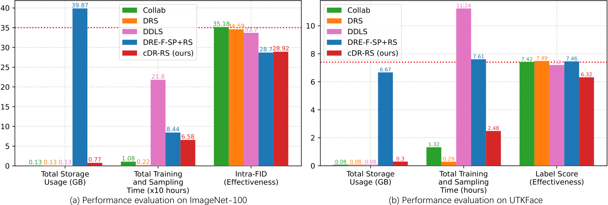

# Efficient Density Ratio-Guided Subsampling of Conditional GANs, With Conditioning on a Class or a Continuous Variable

--------------------------------------------------------

This repository provides the source codes for the experiments in our paper. <br />
If you use this code, please cite
```text
@misc{ding2021efficient,
      title={Efficient Density Ratio-Guided Subsampling of Conditional GANs, With Conditioning on a Class or a Continuous Variable}, 
      author={Xin Ding and Yongwei Wang and Z. Jane Wang and William J. Welch},
      year={2021},
      eprint={2103.11166},
      archivePrefix={arXiv},
      primaryClass={cs.CV}
}
```

--------------------------------------------------------

# Repository Structure

```
├── CIFAR-10
│   ├── cDR-RS
│   ├── DRE-F-SP+RS
│   ├── DRS
│   ├── Collab
│   ├── DDLS
│   ├── GOLD
│   └── GANs
│
├── CIFAR-100
│   ├── cDR-RS
│   ├── DRE-F-SP+RS
│   ├── DRS
│   ├── Collab
│   ├── DDLS
│   └── GANs
│
├── ImageNet-100
│   ├── cDR-RS
│   ├── DRE-F-SP+RS
│   ├── DRS
│   ├── Collab
│   ├── DDLS
│   └── GANs
│
├── UTKFace
│   ├── cDR-RS
│   ├── DRE-F-SP+RS
│   ├── DRS
│   ├── Collab
│   ├── DDLS
│   └── eval_and_gan_ckpts
│
└── RC-49
    ├── cDR-RS
    ├── DRS
    ├── Collab
    └── eval_and_gan_ckpts

```

--------------------------------------------------------

# The overall workflow of cDR-RS

<p align="center">
  
  The overall workflow of cDR-RS.
</p>

--------------------------------------------------------

# Effectiveness and Efficiency Comparison on ImageNet-100 and UTKFace

ImageNet-100                  |  UTKFace
:-------------------------:|:-------------------------:
  |  

-------------------------------

# Software Requirements
| Item | Version |
|---|---|
|Python|3.9.5|
| argparse | 1.1 |
| CUDA  | 11.4 |
| cuDNN| 8.2|
| numpy | 1.14 |
| torch | 1.9.0 |
| torchvision | 0.10.0 |
| Pillow | 8.2.0 |
| matplotlib | 3.4.2 |
| tqdm | 4.61.1 |
| h5py | 3.3.0 |
| Matlab | 2020a |


--------------------------------------------------------

# Datasets
Please refer to [https://github.com/UBCDingXin/improved_CcGAN](https://github.com/UBCDingXin/improved_CcGAN) for the download link of RC-49 and the preprocessed UTKFace datasets. <br />


--------------------------------------------------------

# Sample Usage

run `./scripts/run_train.sh` in the following folders. Remember to set correct root path, data path, and checkpoint path. <br />

## Low-resolution experiments (64x64)
Folders with name `CcGAN` are for the NLI-based CcGAN. Folders with name `CcGAN-improved` are for the ILI-based CcGAN. Foders with name `cGAN (concat)` are for the baseline cGAN (concat) [i.e., cGAN (concat) directly appends regression labels to the input of generator and the last hidden map of discriminator].

### Simulation (`./Simulation`): The Circular 2D Gaussians experiment in our ICLR paper [1].

### RC-49 (64x64) (`./RC-49/RC-49_64x64`)
`./RC-49/RC-49_64x64/CcGAN`: Train AE and ResNet-34 for evaluation. Train cGAN (K classes) and NLI-based CcGAN. <br />
`./RC-49/RC-49_64x64/CcGAN-improved`: Train cGAN (K classes) and ILI-based CcGAN. <br />
`./RC-49/RC-49_64x64/cGAN-concat`: Train cGAN (concat). <br />

### UTKFace (64x64) (`./UTKFace/UTKFace_64x64`)
`./UTKFace/UTKFace_64x64/CcGAN`: Train AE and ResNet-34 for evaluation. Train cGAN (K classes) and NLI-based CcGAN. <br />
`./UTKFace/UTKFace_64x64/CcGAN-improved`: Train cGAN (K classes) and ILI-based CcGAN. <br />
`./UTKFace/UTKFace_64x64/cGAN-concat`: Train cGAN (concat). <br />

### Cell-200 (64x64) (`./Cell-200/Cell-200_64x64`)
`./Cell-200/Cell-200_64x64/CcGAN`: Train AE for evaluation. Train cGAN (K classes) and NLI-based CcGAN. <br />
`./Cell-200/Cell-200_64x64/CcGAN-improved`: Train cGAN (K classes) and ILI-based CcGAN. <br />

### Steering Angle (64x64) (`./SteeringAngle/SteeringAngle_64x64`)
`./SteeringAngle/SteeringAngle_64x64/CcGAN`: Train AE and ResNet-34 for evaluation. Train cGAN (K classes) and NLI-based CcGAN. <br />
`./SteeringAngle/SteeringAngle_64x64/CcGAN-improved`: Train cGAN (K classes) and ILI-based CcGAN. <br />
`./SteeringAngle/SteeringAngle_64x64/cGAN-concat`: Train cGAN (concat). <br />

## High-resolution experiments
In high-resolution experiments, we only compare CcGAN (SVDL+ILI) with cGAN (K classes) and cGAN (concat). For all GANs, we use **SAGAN** [3] as the backbone. We also use **hinge loss** [2] and **DiffAugment** [4].

### RC-49 (128x128)
`./RC-49/RC-49_128x128\CcGAN-improved`: Train AE and ResNet-34 for evaluation. Train cGAN (K classes), cGAN (concat) and CcGAN (SVDL+ILI). <br />

### RC-49 (256x256)
`./RC-49/RC-49_256x256\CcGAN-improved`: Train AE and ResNet-34 for evaluation. Train cGAN (K classes), cGAN (concat) and CcGAN (SVDL+ILI). <br />

### UTKFace (128x128)
`./UTKFace/UTKFace_128x128\CcGAN-improved`: Train AE and ResNet-34 for evaluation. Train cGAN (K classes), cGAN (concat) and CcGAN (SVDL+ILI). <br />

### UTKFace (192x192)
`./UTKFace/UTKFace_192x192\CcGAN-improved`: Train AE and ResNet-34 for evaluation. Train cGAN (K classes), cGAN (concat) and CcGAN (SVDL+ILI). <br />

### Steering Angle (128x128)
`./SteeringAngle/SteeringAngle_128x128\CcGAN-improved`: Train AE and ResNet-34 for evaluation. Train cGAN (K classes), cGAN (concat) and CcGAN (SVDL+ILI). <br />


--------------------------------------------------------

# Computing NIQE
Please refer to [https://github.com/UBCDingXin/improved_CcGAN](https://github.com/UBCDingXin/improved_CcGAN).
