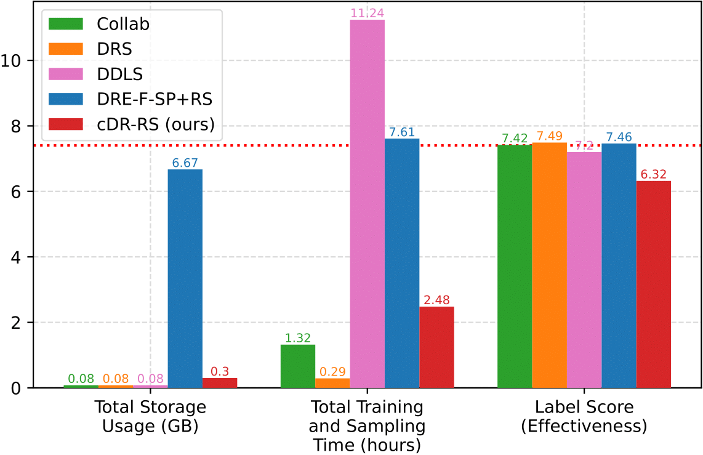

# Efficient Density Ratio-Guided Subsampling of Conditional GANs, With Conditioning on a Class or a Continuous Variable

--------------------------------------------------------

This repository provides the source codes for the experiments in our paper. <br />
If you use this code, please cite
```text
@misc{ding2021efficient,
      title={Efficient Density Ratio-Guided Subsampling of Conditional GANs, With Conditioning on a Class or a Continuous Variable}, 
      author={Xin Ding and Yongwei Wang and Z. Jane Wang and William J. Welch},
      year={2021},
      eprint={2103.11166},
      archivePrefix={arXiv},
      primaryClass={cs.CV}
}
```

--------------------------------------------------------

# Repository Structure

```
├── CIFAR-10
│   ├── cDR-RS
│   ├── DRE-F-SP+RS
│   ├── DRS
│   ├── Collab
│   ├── DDLS
│   ├── GOLD
│   └── GANs
│
├── CIFAR-100
│   ├── cDR-RS
│   ├── DRE-F-SP+RS
│   ├── DRS
│   ├── Collab
│   ├── DDLS
│   └── GANs
│
├── ImageNet-100
│   ├── cDR-RS
│   ├── DRE-F-SP+RS
│   ├── DRS
│   ├── Collab
│   ├── DDLS
│   └── GANs
│
├── UTKFace
│   ├── cDR-RS
│   ├── DRE-F-SP+RS
│   ├── DRS
│   ├── Collab
│   ├── DDLS
│   └── eval_and_gan_ckpts
│
└── RC-49
    ├── cDR-RS
    ├── DRS
    ├── Collab
    └── eval_and_gan_ckpts

```

--------------------------------------------------------

# The overall workflow of cDR-RS

<p align="center">
  
  The overall workflow of cDR-RS.
</p>

--------------------------------------------------------

# Effectiveness and Efficiency Comparison on ImageNet-100 and UTKFace

<!-- ImageNet-100                  |  UTKFace
:-------------------------:|:-------------------------:
  |   -->


<p align="center">
  
  Effectiveness and Efficiency Comparison on ImageNet-100
</p>

<p align="center">
  
  Effectiveness and Efficiency Comparison on UTKFace
</p>

-------------------------------

# Software Requirements
| Item | Version |
|---|---|
|Python|3.9.5|
| argparse | 1.1 |
| CUDA  | 11.4 |
| cuDNN| 8.2|
| numpy | 1.14 |
| torch | 1.9.0 |
| torchvision | 0.10.0 |
| Pillow | 8.2.0 |
| matplotlib | 3.4.2 |
| tqdm | 4.61.1 |
| h5py | 3.3.0 |
| Matlab | 2020a |


--------------------------------------------------------

# Datasets
Please refer to [https://github.com/UBCDingXin/improved_CcGAN](https://github.com/UBCDingXin/improved_CcGAN) for the download link of RC-49 and the preprocessed UTKFace datasets. <br />
Download RC-49 (64x64) and UTKFace (64x64) h5 files and put them in `./datasets/RC-49` and `./datasets/UTKFace`, respectively. <br />

--------------------------------------------------------

# Sample Usage

Run `./scripts/run_train.sh` in the following folders. Remember to set correct root path, data path, and checkpoint path. Please also remember to download corresponding checkpoints for each experiment. <br />

## Class-conditional GANs

### CIFAR-10 (`./CIFAR-10`)
Download [eval_models.zip](https://1drv.ms/u/s!Arj2pETbYnWQuZpPw7kYJqSe9Ng75w?e=Tfm2AX). Unzip `eval_models.zip` to get `eval_models`, and move `eval_models` to `./CIFAR-10`.  <br />

<!-- `./RC-49/RC-49_64x64/CcGAN`: Train AE and ResNet-34 for evaluation. Train cGAN (K classes) and NLI-based CcGAN. <br />
`./RC-49/RC-49_64x64/CcGAN-improved`: Train cGAN (K classes) and ILI-based CcGAN. <br />
`./RC-49/RC-49_64x64/cGAN-concat`: Train cGAN (concat). <br /> -->

### CIFAR-100 (`./CIFAR-100`)
Download [eval_models.zip](https://1drv.ms/u/s!Arj2pETbYnWQuZpOIqpOBhWSzL9xNw?e=PiOPCh). Unzip `eval_models.zip` to get `eval_models`, and move `eval_models` to `./CIFAR-100`. <br />

<!-- `./UTKFace/UTKFace_64x64/CcGAN`: Train AE and ResNet-34 for evaluation. Train cGAN (K classes) and NLI-based CcGAN. <br />
`./UTKFace/UTKFace_64x64/CcGAN-improved`: Train cGAN (K classes) and ILI-based CcGAN. <br />
`./UTKFace/UTKFace_64x64/cGAN-concat`: Train cGAN (concat). <br /> -->

### ImageNet-100 (`./ImageNet-100`)
Download [eval_models.zip](https://1drv.ms/u/s!Arj2pETbYnWQuZpQhdrN9bCvbtaoaA?e=qcrfZ3). Unzip `eval_models.zip` to get `eval_models`, and move `eval_models` to `./ImageNet-100`. <br />

<!-- `./Cell-200/Cell-200_64x64/CcGAN`: Train AE for evaluation. Train cGAN (K classes) and NLI-based CcGAN. <br />
`./Cell-200/Cell-200_64x64/CcGAN-improved`: Train cGAN (K classes) and ILI-based CcGAN. <br /> -->


## CcGANs

### UTKFace (`./UTKFace`)
Download [eval_and_gan_ckpts.zip](https://1drv.ms/u/s!Arj2pETbYnWQuZpRaaDohsH5T0qFzg?e=c4McJ1). Unzip `eval_and_gan_ckpts.zip` to get `eval_and_gan_ckpts`, and move `eval_and_gan_ckpts` to `./UTKFace`.  <br />

<!-- `./RC-49/RC-49_128x128\CcGAN-improved`: Train AE and ResNet-34 for evaluation. Train cGAN (K classes), cGAN (concat) and CcGAN (SVDL+ILI). <br /> -->

### RC-49 (`./RC-49`)
Download [eval_and_gan_ckpts.zip](https://1drv.ms/u/s!Arj2pETbYnWQuZpShcQiZq8IzOFGQg?e=ZHdv2k). Unzip `eval_and_gan_ckpts.zip` to get `eval_and_gan_ckpts`, and move `eval_and_gan_ckpts` to `./RC-49`. <br />


<!-- `./RC-49/RC-49_256x256\CcGAN-improved`: Train AE and ResNet-34 for evaluation. Train cGAN (K classes), cGAN (concat) and CcGAN (SVDL+ILI). <br /> -->

--------------------------------------------------------

# Computing NIQE of fake images sampled from CcGANs
Please refer to [https://github.com/UBCDingXin/improved_CcGAN](https://github.com/UBCDingXin/improved_CcGAN).
